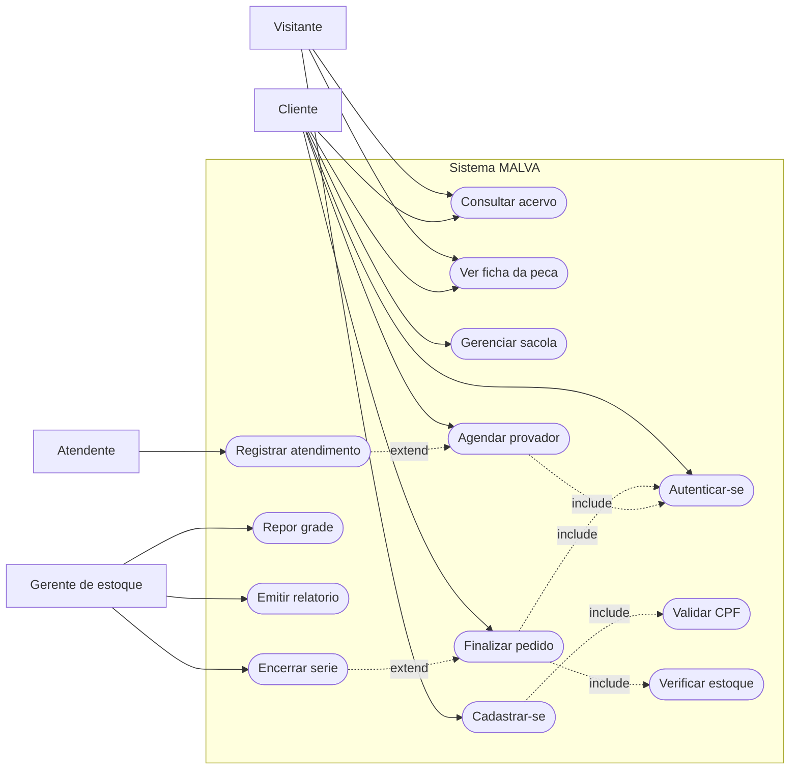
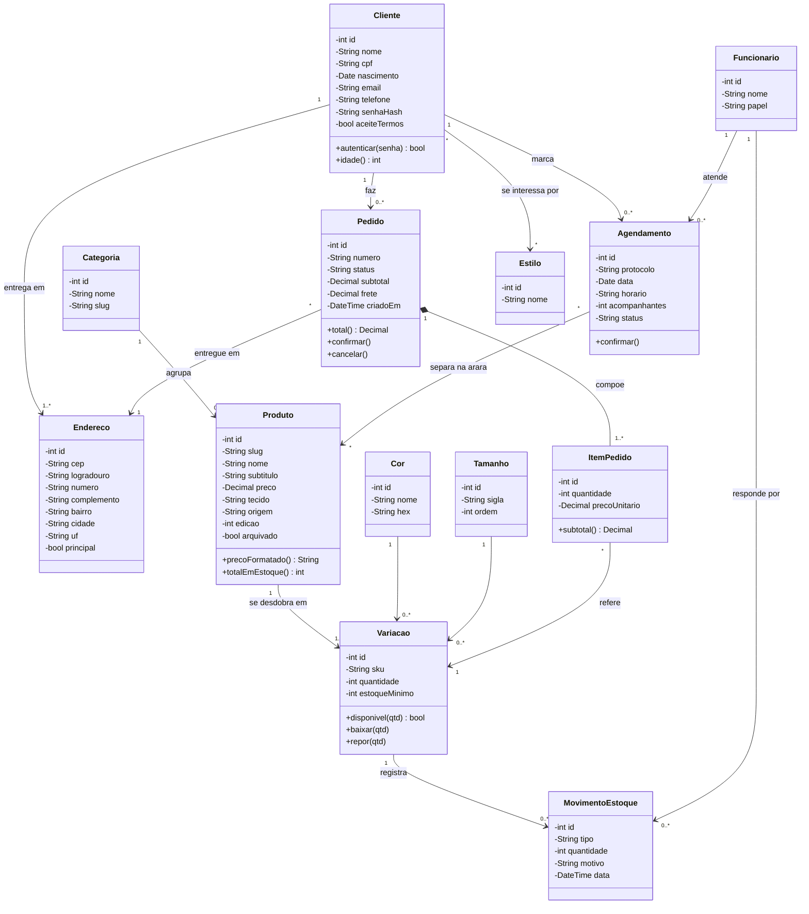
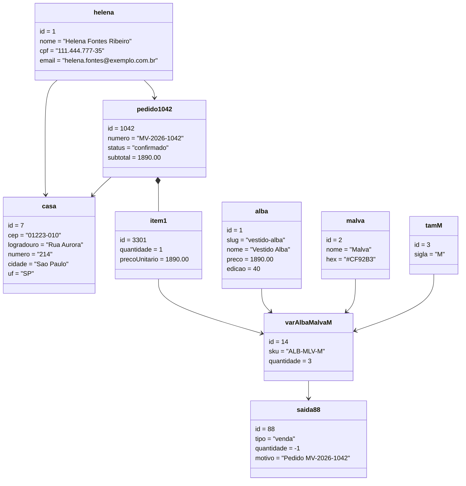
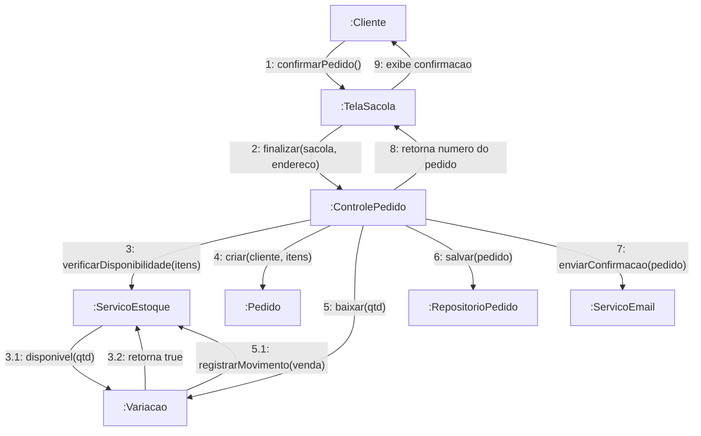
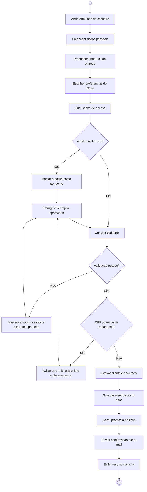
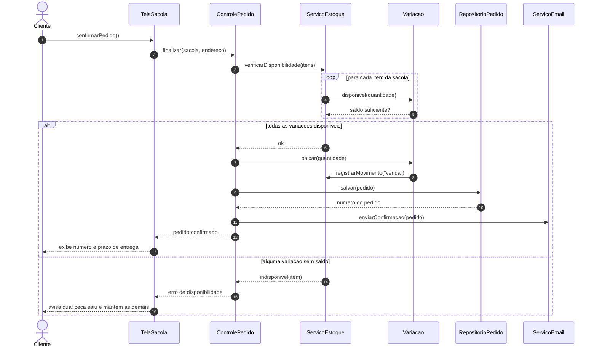

# Diagramas UML — Sistema MALVA

Os seis diagramas pedidos. Todos em Mermaid, que o GitHub desenha
sozinho ao abrir este arquivo — não é preciso instalar nada.

Quatro deles (objeto, interação, atividade e sequência) percorrem a
**mesma história**: Helena abre a ficha, escolhe o Vestido Alba em
malva no tamanho M e fecha o pedido. Isso deixa claro que descrevem o
mesmo sistema visto de ângulos diferentes.

---

## 1. Diagrama de Casos de Uso

Quem usa o sistema e para quê. `«include»` marca o que sempre acontece
junto; `«extend»`, o que só acontece em certas condições.

**Caso de uso expandido — UC06 Finalizar pedido**

| | |
|---|---|
| **Ator principal** | Cliente |
| **Pré-condição** | Sacola com ao menos um item; cliente autenticada |
| **Fluxo principal** | 1. A cliente abre a sacola. 2. Confere itens e subtotal. 3. Escolhe o endereço de entrega. 4. Confirma. 5. O sistema verifica o estoque de cada variação. 6. Registra o pedido, dá baixa na grade e emite o número. |
| **Fluxo alternativo A** | No passo 5, se a variação não tiver saldo, o sistema avisa qual peça saiu e mantém as demais na sacola. |
| **Fluxo alternativo B** | No passo 5, se a baixa zerar a grade e a série estiver completa, o sistema arquiva a modelagem (UC13). |
| **Pós-condição** | Pedido gravado, estoque reduzido e confirmação enviada por e-mail. |

---

## 2. Diagrama de Classes

O modelo do domínio. A classe central é **Variacao**: é ela, e não
Produto, que tem saldo — porque o mesmo vestido em duas cores são dois
estoques diferentes (RN02).

---

## 3. Diagrama de Objetos

Um retrato do sistema num instante: o pedido da Helena, logo depois de
confirmado. Mostra os mesmos vínculos do diagrama de classes, agora com
valores.

> Leitura: `varAlbaMalvaM` tinha 4 unidades; a venda de uma gerou o
> movimento `saida88` e o saldo caiu para 3.

---

## 4. Diagrama de Interação (comunicação)

O mesmo pedido, agora pelo ângulo de **quem fala com quem**. A numeração
dá a ordem das mensagens — é a diferença entre o diagrama de comunicação
e o de sequência, que ordena pelo tempo, de cima para baixo.

---

## 5. Diagrama de Atividades

O fluxo do **cadastro de cliente** — a tela `/cadastro`, com os 22
campos. O losango de validação é o laço que o formulário faz de verdade:
ele não avança enquanto houver pendência, e volta marcando os campos.

---

## 6. Diagrama de Sequência

O mesmo caso de uso do diagrama de comunicação, ordenado no tempo. O
bloco `alt` mostra o fluxo alternativo A do UC06: a peça que saiu de
estoque entre a escolha e a confirmação.

---

## Resumo

| # | Diagrama | Responde |
|---|---|---|
| 1 | Casos de uso | Quem usa o sistema e para quê |
| 2 | Classes | Que conceitos existem e como se ligam |
| 3 | Objetos | Como esses conceitos ficam preenchidos num instante |
| 4 | Interação (comunicação) | Quem conversa com quem para fechar um pedido |
| 5 | Atividades | Que caminho o cadastro percorre, com desvios e laços |
| 6 | Sequência | A mesma conversa do nº 4, ordenada no tempo |
