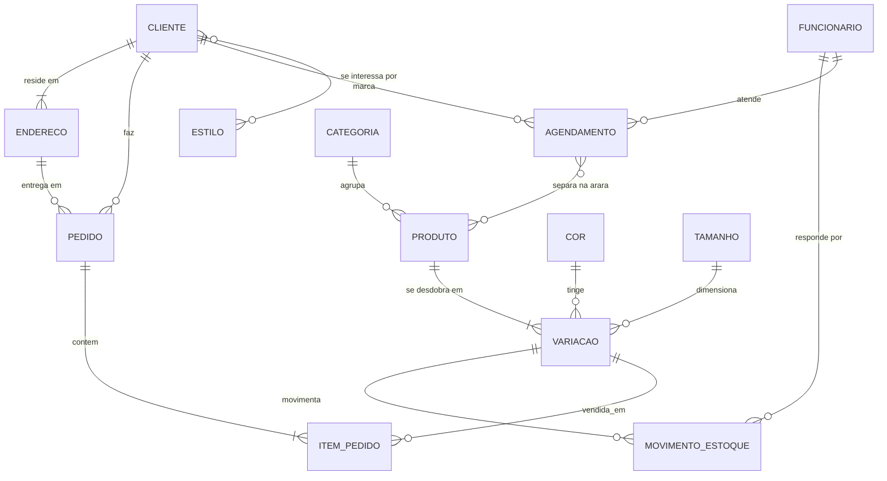
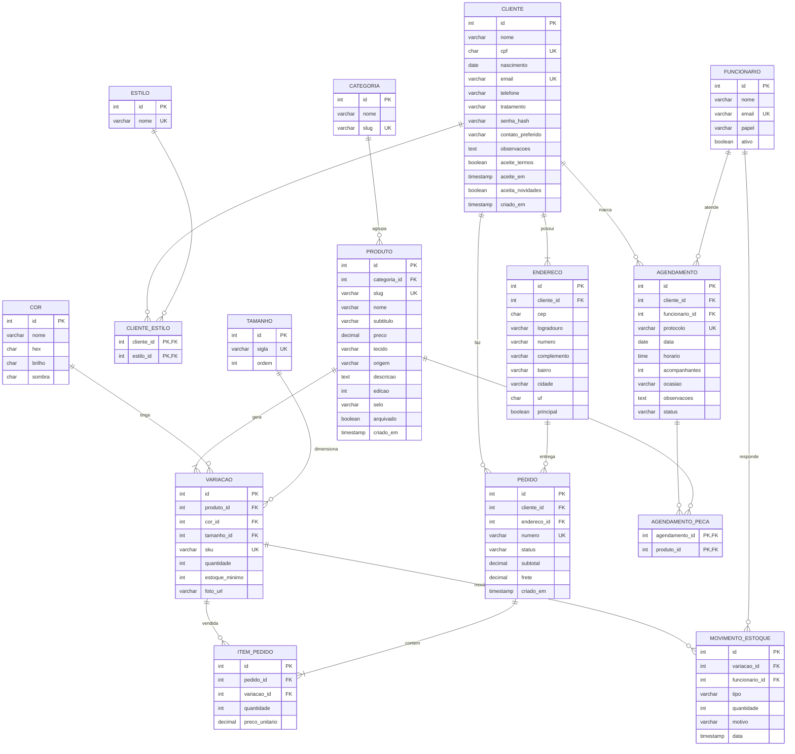

# Modelo de Dados — Sistema MALVA

MER conceitual, DER lógico, dicionário de dados e o script de criação.

A decisão que organiza todo o modelo é a **RN02**: a unidade de estoque
não é a peça, é a **variação** — peça × cor × tamanho. O Vestido Alba em
pérola tamanho M e o mesmo vestido em malva tamanho M são duas linhas de
estoque independentes. Por isso `VARIACAO` fica no centro do diagrama, e
não `PRODUTO`.

---

## 1. MER — modelo conceitual

Entidades, relacionamentos e cardinalidades, sem tipos nem chaves.



**Leitura das cardinalidades**

| Relacionamento | Lê-se |
|---|---|
| `CLIENTE ||--|{ ENDERECO` | toda cliente tem **um ou mais** endereços; todo endereço pertence a **uma** cliente |
| `CLIENTE ||--o{ PEDIDO` | a cliente pode ter **zero ou muitos** pedidos |
| `PRODUTO ||--|{ VARIACAO` | toda peça existe em **ao menos uma** variação |
| `CLIENTE }o--o{ ESTILO` | muitos para muitos — resolvido pela tabela `CLIENTE_ESTILO` |
| `AGENDAMENTO }o--o{ PRODUTO` | muitos para muitos — resolvido por `AGENDAMENTO_PECA` |

---

## 2. DER — modelo lógico

Já com atributos, tipos, chaves primárias (PK) e estrangeiras (FK), e as
duas tabelas associativas que resolvem os relacionamentos N:N.



---

## 3. Dicionário de dados

### CLIENTE — a ficha aberta em `/cadastro`

| Coluna | Tipo | Nulo | Regra |
|---|---|:--:|---|
| id | INT | não | PK, auto |
| nome | VARCHAR(120) | não | nome e sobrenome |
| cpf | CHAR(11) | não | único, dígitos verificadores conferidos (RF18) |
| nascimento | DATE | não | idade ≥ 16 (RN06) |
| email | VARCHAR(160) | não | único |
| telefone | VARCHAR(11) | não | 10 ou 11 dígitos com DDD |
| tratamento | VARCHAR(20) | sim | sem · sra · srta · nao-informar |
| senha_hash | VARCHAR(255) | não | bcrypt/argon2, nunca texto puro (RNF13) |
| contato_preferido | VARCHAR(20) | não | whatsapp · email · ligacao |
| observacoes | TEXT | sim | até 400 caracteres |
| aceite_termos | BOOLEAN | não | obrigatório true (RF21) |
| aceite_em | TIMESTAMP | não | data e hora do aceite (RNF16) |
| aceita_novidades | BOOLEAN | não | padrão true |
| criado_em | TIMESTAMP | não | padrão agora |

### VARIACAO — a unidade de estoque

| Coluna | Tipo | Nulo | Regra |
|---|---|:--:|---|
| id | INT | não | PK |
| produto_id | INT | não | FK → PRODUTO |
| cor_id | INT | não | FK → COR |
| tamanho_id | INT | não | FK → TAMANHO |
| sku | VARCHAR(40) | não | único, ex. `ALB-MLV-M` |
| quantidade | INT | não | **≥ 0**, garantido por CHECK (RNF18) |
| estoque_minimo | INT | não | dispara o aviso de reposição (RF35) |
| foto_url | VARCHAR(255) | sim | foto da peça naquele banho de cor |

> A tripla (produto_id, cor_id, tamanho_id) é **única**: não pode existir
> a mesma variação duas vezes.

### MOVIMENTO_ESTOQUE — o histórico que explica o saldo

| Coluna | Tipo | Nulo | Regra |
|---|---|:--:|---|
| tipo | VARCHAR(20) | não | entrada · venda · devolucao · ajuste · perda |
| quantidade | INT | não | positiva na entrada, negativa na saída |
| motivo | VARCHAR(160) | sim | ex. "Pedido MV-2026-1042" |
| data | TIMESTAMP | não | padrão agora |

> O saldo de `VARIACAO.quantidade` é sempre a soma dos movimentos. Guardar
> os dois permite auditar: se divergirem, houve gravação fora do fluxo.

---

## 4. Normalização

O modelo está na **3ª forma normal**:

| Forma | Como foi atendida |
|---|---|
| **1FN** | Nenhum campo multivalorado. As cores de uma peça não são uma lista numa coluna: viraram linhas em `VARIACAO`. Os estilos da cliente viraram `CLIENTE_ESTILO`. |
| **2FN** | Nas tabelas de chave composta (`CLIENTE_ESTILO`, `AGENDAMENTO_PECA`) não há atributo que dependa de só parte da chave — elas só têm a chave. |
| **3FN** | Nenhum campo depende de outro não-chave. `ITEM_PEDIDO.preco_unitario` **não** é redundância de `PRODUTO.preco`: é o preço **no dia da compra**, que precisa ser preservado mesmo que a peça mude de preço depois. |

---

## 5. Script de criação (PostgreSQL)

```sql
CREATE TABLE cliente (
  id                SERIAL PRIMARY KEY,
  nome              VARCHAR(120) NOT NULL,
  cpf               CHAR(11)     NOT NULL UNIQUE,
  nascimento        DATE         NOT NULL,
  email             VARCHAR(160) NOT NULL UNIQUE,
  telefone          VARCHAR(11)  NOT NULL,
  tratamento        VARCHAR(20),
  senha_hash        VARCHAR(255) NOT NULL,
  contato_preferido VARCHAR(20)  NOT NULL DEFAULT 'whatsapp',
  observacoes       TEXT,
  aceite_termos     BOOLEAN      NOT NULL,
  aceite_em         TIMESTAMP    NOT NULL DEFAULT NOW(),
  aceita_novidades  BOOLEAN      NOT NULL DEFAULT TRUE,
  criado_em         TIMESTAMP    NOT NULL DEFAULT NOW(),
  CONSTRAINT ck_cliente_aceite  CHECK (aceite_termos = TRUE),
  CONSTRAINT ck_cliente_idade   CHECK (nascimento <= CURRENT_DATE - INTERVAL '16 years')
);

CREATE TABLE endereco (
  id          SERIAL PRIMARY KEY,
  cliente_id  INT          NOT NULL REFERENCES cliente(id) ON DELETE CASCADE,
  cep         CHAR(8)      NOT NULL,
  logradouro  VARCHAR(160) NOT NULL,
  numero      VARCHAR(10)  NOT NULL,
  complemento VARCHAR(60),
  bairro      VARCHAR(80)  NOT NULL,
  cidade      VARCHAR(80)  NOT NULL,
  uf          CHAR(2)      NOT NULL,
  principal   BOOLEAN      NOT NULL DEFAULT FALSE
);

CREATE TABLE estilo (
  id   SERIAL PRIMARY KEY,
  nome VARCHAR(60) NOT NULL UNIQUE
);

CREATE TABLE cliente_estilo (
  cliente_id INT NOT NULL REFERENCES cliente(id) ON DELETE CASCADE,
  estilo_id  INT NOT NULL REFERENCES estilo(id),
  PRIMARY KEY (cliente_id, estilo_id)
);

CREATE TABLE categoria (
  id   SERIAL PRIMARY KEY,
  nome VARCHAR(60) NOT NULL,
  slug VARCHAR(60) NOT NULL UNIQUE
);

CREATE TABLE produto (
  id           SERIAL PRIMARY KEY,
  categoria_id INT           NOT NULL REFERENCES categoria(id),
  slug         VARCHAR(80)   NOT NULL UNIQUE,
  nome         VARCHAR(120)  NOT NULL,
  subtitulo    VARCHAR(160),
  preco        DECIMAL(10,2) NOT NULL,
  tecido       VARCHAR(120),
  origem       VARCHAR(160),
  descricao    TEXT,
  edicao       INT           NOT NULL,
  selo         VARCHAR(20),
  arquivado    BOOLEAN       NOT NULL DEFAULT FALSE,
  criado_em    TIMESTAMP     NOT NULL DEFAULT NOW(),
  CONSTRAINT ck_produto_preco  CHECK (preco > 0),
  CONSTRAINT ck_produto_edicao CHECK (edicao BETWEEN 1 AND 60)  -- RN01
);

CREATE TABLE cor (
  id     SERIAL PRIMARY KEY,
  nome   VARCHAR(60) NOT NULL,
  hex    CHAR(7)     NOT NULL,
  brilho CHAR(7),
  sombra CHAR(7)
);

CREATE TABLE tamanho (
  id    SERIAL PRIMARY KEY,
  sigla VARCHAR(10) NOT NULL UNIQUE,
  ordem INT         NOT NULL
);

CREATE TABLE variacao (
  id             SERIAL PRIMARY KEY,
  produto_id     INT         NOT NULL REFERENCES produto(id) ON DELETE CASCADE,
  cor_id         INT         NOT NULL REFERENCES cor(id),
  tamanho_id     INT         NOT NULL REFERENCES tamanho(id),
  sku            VARCHAR(40) NOT NULL UNIQUE,
  quantidade     INT         NOT NULL DEFAULT 0,
  estoque_minimo INT         NOT NULL DEFAULT 1,
  foto_url       VARCHAR(255),
  CONSTRAINT uq_variacao     UNIQUE (produto_id, cor_id, tamanho_id),
  CONSTRAINT ck_variacao_qtd CHECK (quantidade >= 0)  -- RNF18
);

CREATE TABLE funcionario (
  id    SERIAL PRIMARY KEY,
  nome  VARCHAR(120) NOT NULL,
  email VARCHAR(160) NOT NULL UNIQUE,
  papel VARCHAR(30)  NOT NULL,
  ativo BOOLEAN      NOT NULL DEFAULT TRUE,
  CONSTRAINT ck_funcionario_papel
    CHECK (papel IN ('atendente', 'gerente', 'modelista'))
);

CREATE TABLE movimento_estoque (
  id             SERIAL PRIMARY KEY,
  variacao_id    INT         NOT NULL REFERENCES variacao(id),
  funcionario_id INT         REFERENCES funcionario(id),
  tipo           VARCHAR(20) NOT NULL,
  quantidade     INT         NOT NULL,
  motivo         VARCHAR(160),
  data           TIMESTAMP   NOT NULL DEFAULT NOW(),
  CONSTRAINT ck_movimento_tipo
    CHECK (tipo IN ('entrada', 'venda', 'devolucao', 'ajuste', 'perda')),
  CONSTRAINT ck_movimento_qtd CHECK (quantidade <> 0)
);

CREATE TABLE pedido (
  id          SERIAL PRIMARY KEY,
  cliente_id  INT           NOT NULL REFERENCES cliente(id),
  endereco_id INT           NOT NULL REFERENCES endereco(id),
  numero      VARCHAR(20)   NOT NULL UNIQUE,
  status      VARCHAR(20)   NOT NULL DEFAULT 'aguardando',
  subtotal    DECIMAL(10,2) NOT NULL,
  frete       DECIMAL(10,2) NOT NULL DEFAULT 0,
  criado_em   TIMESTAMP     NOT NULL DEFAULT NOW(),
  CONSTRAINT ck_pedido_status
    CHECK (status IN ('aguardando','confirmado','enviado','entregue','cancelado'))
);

CREATE TABLE item_pedido (
  id              SERIAL PRIMARY KEY,
  pedido_id       INT           NOT NULL REFERENCES pedido(id) ON DELETE CASCADE,
  variacao_id     INT           NOT NULL REFERENCES variacao(id),
  quantidade      INT           NOT NULL,
  preco_unitario  DECIMAL(10,2) NOT NULL,
  CONSTRAINT ck_item_qtd CHECK (quantidade BETWEEN 1 AND 5)  -- RF13
);

CREATE TABLE agendamento (
  id             SERIAL PRIMARY KEY,
  cliente_id     INT         NOT NULL REFERENCES cliente(id),
  funcionario_id INT         REFERENCES funcionario(id),
  protocolo      VARCHAR(20) NOT NULL UNIQUE,
  data           DATE        NOT NULL,
  horario        TIME        NOT NULL,
  acompanhantes  INT         NOT NULL DEFAULT 1,
  ocasiao        VARCHAR(60),
  observacoes    TEXT,
  status         VARCHAR(20) NOT NULL DEFAULT 'marcado',
  CONSTRAINT uq_agenda_horario UNIQUE (data, horario),          -- RF31
  CONSTRAINT ck_agenda_sala    CHECK (acompanhantes BETWEEN 1 AND 4),  -- RN04
  CONSTRAINT ck_agenda_dia     CHECK (EXTRACT(DOW FROM data) NOT IN (0, 1))  -- RN03
);

CREATE TABLE agendamento_peca (
  agendamento_id INT NOT NULL REFERENCES agendamento(id) ON DELETE CASCADE,
  produto_id     INT NOT NULL REFERENCES produto(id),
  PRIMARY KEY (agendamento_id, produto_id)
);

-- Índices para as consultas mais frequentes
CREATE INDEX ix_variacao_produto  ON variacao (produto_id);
CREATE INDEX ix_variacao_baixa    ON variacao (quantidade) WHERE quantidade <= estoque_minimo;
CREATE INDEX ix_pedido_cliente    ON pedido (cliente_id, criado_em DESC);
CREATE INDEX ix_movimento_data    ON movimento_estoque (variacao_id, data DESC);
CREATE INDEX ix_produto_categoria ON produto (categoria_id) WHERE arquivado = FALSE;
```

---

## 6. Consultas de apoio

```sql
-- Posição de estoque por peça (RF36)
SELECT p.nome, c.nome AS cor, t.sigla AS tamanho, v.quantidade
  FROM variacao v
  JOIN produto p ON p.id = v.produto_id
  JOIN cor     c ON c.id = v.cor_id
  JOIN tamanho t ON t.id = v.tamanho_id
 WHERE p.arquivado = FALSE
 ORDER BY p.nome, c.nome, t.ordem;

-- Grades que bateram o estoque mínimo (RF35)
SELECT p.nome, c.nome AS cor, t.sigla, v.quantidade, v.estoque_minimo
  FROM variacao v
  JOIN produto p ON p.id = v.produto_id
  JOIN cor     c ON c.id = v.cor_id
  JOIN tamanho t ON t.id = v.tamanho_id
 WHERE v.quantidade <= v.estoque_minimo;

-- Peças mais vendidas no mês (RF36)
SELECT p.nome, SUM(i.quantidade) AS vendidas
  FROM item_pedido i
  JOIN variacao v ON v.id = i.variacao_id
  JOIN produto  p ON p.id = v.produto_id
  JOIN pedido   d ON d.id = i.pedido_id
 WHERE d.status <> 'cancelado'
   AND d.criado_em >= DATE_TRUNC('month', CURRENT_DATE)
 GROUP BY p.nome
 ORDER BY vendidas DESC;

-- Conferência: o saldo bate com o histórico de movimentos?
SELECT v.sku, v.quantidade AS saldo,
       COALESCE(SUM(m.quantidade), 0) AS pelos_movimentos
  FROM variacao v
  LEFT JOIN movimento_estoque m ON m.variacao_id = v.id
 GROUP BY v.id, v.sku, v.quantidade
HAVING v.quantidade <> COALESCE(SUM(m.quantidade), 0);
```
